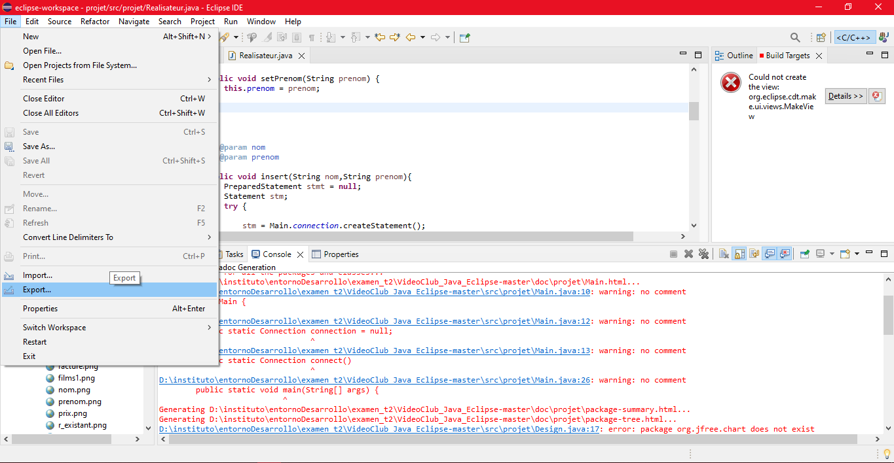
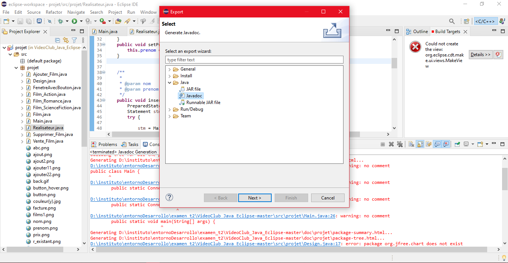
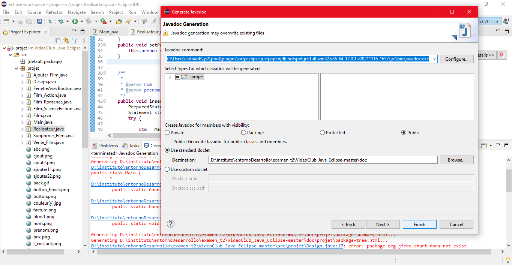

# Ejercicio 1 - Examen Trimestre 2
## Respuesta
> El proyecto dado en el repositorio https://github.com/HatemHamdi/VideoClub_Java_Eclipse está hecho con el lenguaje de programación **Java**.

> Me han hecho cargo de generar la documentación técnica de dicho proyecto y para ello voy a utilizar **JavaDocs**. Cabe recalcar que el idioma de la mayoría de variables está en **francés** y, que en el proceso, yo estaba haciéndolo con NetBeans y era imposible generar la documentación ya que ni siquiera compilaba el programa porque usaba librerías de **Eclipse** por lo que tuve que hacerlo con dicho programa.
> Procedo creando líneas de comentarios con los parámetros necesarios en las funciones y métodos, encima de cada uno de ellos que creo convenientes para la comprensión del código.
> Una vez terminado, procedo a generar la documentación con **JavaDocs** visible en el repositorio.

> Para visualizar la documentación debe descargar todos los ficheros del repositorio y abrir **index.html** con tu navegador favorito.

### Proceso de generacion de JavaDocs
1. Una vez documentado el codigo hacer click en `File > Export...`

2. Hacer click en `Java > JavaDoc`

3. Finalizar haciendo click sobre `Finish`

